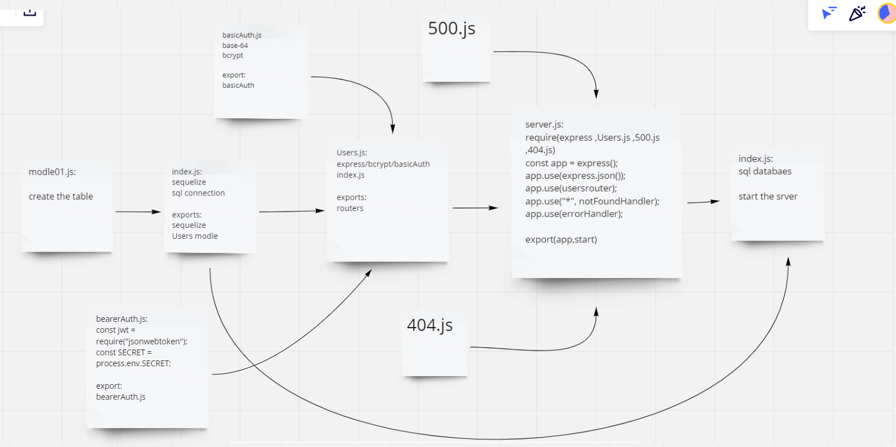

# bearer-auth

this application is a server that works on authntication with sign in and sign up and its connected to database to save the user name and password every time od sign up.

it also works on bearer Authorization witch generate a token every time of sign in and use this token with the request to validate the user.

## UML

## linkes

https://saad-alzubi-bearerAuth.herokuapp.com/

https://github.com/saadomaralzoubi/bearer-auth/pull/1

https://github.com/saadomaralzoubi/bearer-auth/actions
